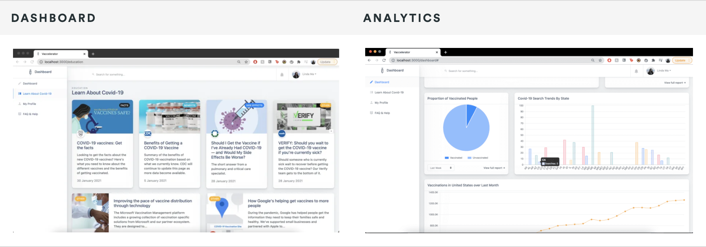

[![Contributors][contributors-shield]][contributors-url]
[![Forks][forks-shield]][forks-url]
[![Stargazers][stars-shield]][stars-url]
[![Issues][issues-shield]][issues-url]
[![MIT License][license-shield]][license-url]

<!-- TABLE OF CONTENTS -->
<details open="open">
  <summary>Table of Contents</summary>
  <ol>
    <li>
      <a href="#about-the-project">About The Project</a>
      <ul>
        <li><a href="#built-with">Built With</a></li>
      </ul>
    </li>
    <li>
      <a href="#getting-started">Getting Started</a>
      <ul>
        <li><a href="#prerequisites">Prerequisites</a></li>
        <li><a href="#installation">Installation</a></li>
      </ul>
    </li>
    <li><a href="#usage">Usage</a></li>
    <li><a href="#roadmap">Roadmap</a></li>
    <li><a href="#contributing">Contributing</a></li>
    <li><a href="#license">License</a></li>
    <li><a href="#contact">Contact</a></li>
  </ol>
</details>


<!-- ABOUT THE PROJECT -->
## About The Project
<p align="center">
  
</p>

Vaccelerator aids users in having an easy-to-use and personalized vaccine sign up. Users are able to view the dashboard showing relevant and visual data about the vaccine rollout plan. We utilize the power of Google search trends to further find the areas of highest prioritization for the vaccine. This helps distributors identify high priority regions and better allocate resources. Vaccelerator also features an education section filled with articles about the vaccine and Covid-19 news. Additionally, there is an FAQ page for frequently asked questions.

### Built With
* [JavaScript](https://www.javascript.com/)
* [React.js](https://reactjs.org/)
* [Chart.js](https://www.chartjs.org/)
* [Material-UI](https://material-ui.com/)
* [Twilio](https://www.twilio.com/)
* [Firebase SDK](https://firebase.google.com/)
* [Cloud Firestore](https://firebase.google.com/docs/firestore)
* [Firebase Authentication](https://firebase.google.com/docs/auth)
* [Google Cloud Functions](https://cloud.google.com/functions)
* [Node.js](https://nodejs.org/)
* [Express.js](https://expressjs.com/)
* [Plotly](https://plotly.com/)
* [Pandas](https://pandas.pydata.org/)


## Getting Started
### Prerequisites
* npm
  ```sh
  npm install npm@latest -g
  ```

### Installation
1. Clone the repo
   ```sh
   git clone https://github.com/rexliu3/Hack-UCI.git
   ```
2. Change directory
   ```sh
   cd frontend
   ```
3. Install NPM packages
   ```sh
   npm install
   ```


<!-- USAGE EXAMPLES -->
## Usage
Run node application
   ```sh
   npm run
   ```

Note: Not all dashboard displays may function as the .env file has been removed for security


<!-- ROADMAP -->
## Roadmap
See the [open issues](https://github.com/rexliu3/Hack-UCI/issues) for a list of proposed features (and known issues).


<!-- CONTRIBUTING -->
## Contributing
Contributions are what make the open source community such an amazing place to be learn, inspire, and create. Any contributions you make are **greatly appreciated**.

1. Fork the Project
2. Create your Feature Branch (`git checkout -b feature/AmazingFeature`)
3. Commit your Changes (`git commit -m 'Add some AmazingFeature'`)
4. Push to the Branch (`git push origin feature/AmazingFeature`)
5. Open a Pull Request


<!-- LICENSE -->
## License
Distributed under the MIT License. See `LICENSE` for more information.


<!-- CONTACT -->
## Contact
Project Link: [https://github.com/rexliu3/Hack-UCI](https://github.com/rexliu3/Hack-UCI)
DevPost Link: [https://devpost.com/software/vaccelerator](https://devpost.com/software/vaccelerator)


[contributors-shield]: https://img.shields.io/github/contributors/rexliu3/Hack-UCI?style=for-the-badge
[contributors-url]: https://github.com/rexliu3/Hack-UCI/graphs/contributors
[forks-shield]: https://img.shields.io/github/forks/rexliu3/Hack-UCI?style=for-the-badge
[forks-url]: https://github.com/rexliu3/Hack-UCI/network/members
[stars-shield]: https://img.shields.io/github/stars/rexliu3/Hack-UCI?style=for-the-badge
[stars-url]: https://github.com/rexliu3/Hack-UCI/stargazers
[issues-shield]: https://img.shields.io/github/issues/rexliu3/Hack-UCI?style=for-the-badge
[issues-url]: https://github.com/rexliu3/Hack-UCI/issues
[license-shield]: https://img.shields.io/github/license/othneildrew/Best-README-Template.svg?style=for-the-badge
[license-url]: https://github.com/rexliu3/Hack-UCI/blob/master/LICENSE.txt
